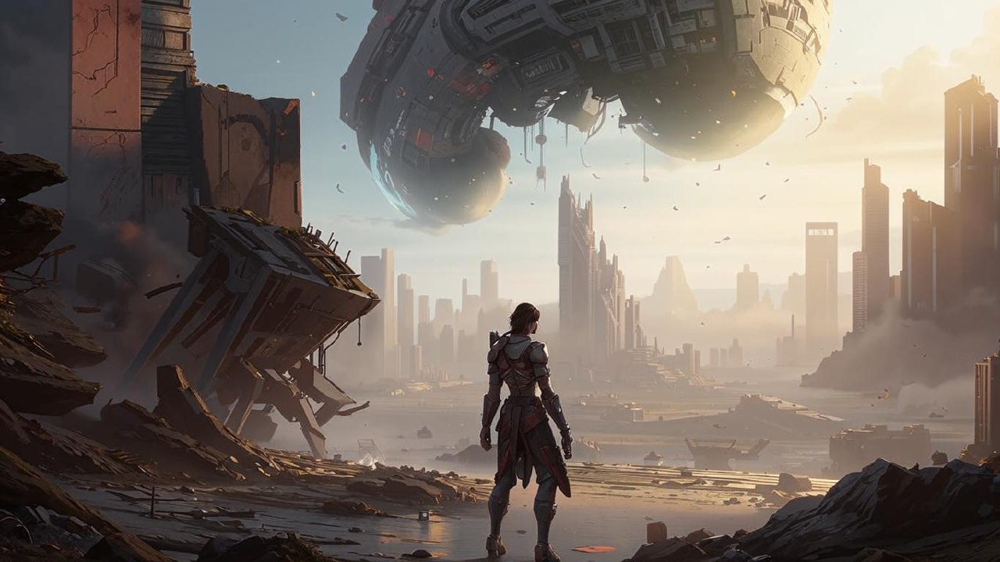

<h1>Gravity Flux</h1>
<h2>Описание</h2>

<h3>Сюжет:</h3>

В недалеком будущем человечество решило радикально изменить основы управления энергией, начав эксперименты с гравитацией. Однако амбициозный эксперимент пошел не по плану — баланс сил был нарушен, и мир погрузился в хаос. Законы физики перестали работать так, как привыкли, и повсюду начали возникать аномалии.

<b>Герой с необычной способностью</b>

В разгар этого хаоса появляется главный герой, обладающий уникальной способностью манипулировать гравитацией. Именно он может изменять силу притяжения, что позволяет ему не только преодолевать опасные препятствия, но и сражаться с врагами.

<b>Путешествие сквозь разрушенный мир</b>

Герою предстоит пройти через разрушенные города, изменчивые пейзажи и локации, где гравитация постоянно меняется. Каждая карта уровня — это новое испытание, где правильное использование силы гравитации может стать ключом к победе над противниками. На пути его ждут мощные враги.

<b>Тайна за гранью понимания</b>

По мере прохождения уровней герой начинает собирать фрагменты правды: оказывается, за катастрофой стоит тайная организация, стремившаяся использовать гравитацию для установления абсолютной власти. Ее представители скрываются в плавающем форте, где, по слухам, и разворачивается финальная битва за судьбу мира.

<b>Финальное противостояние</b> (Предстоит реализовать)

На кульминационном этапе игры герой сталкивается с главным антагонистом, чьи планы могут изменить само устройство вселенной. От успешного сражения зависит не только его судьба, но и будущее всего человечества. Победа даст шанс восстановить нарушенный баланс гравитации, вернуть мир и надежду на новую эру.

─────────────────────────────────────

<b>Запуск игры</b> - 🐍Gravity_Flux.py

Вспомогательные файлы в папке <strong>scr</strong>:

<ol>
    <li>Файл, содержащий все классы - 🐍classes.py</li>
    <li>Файл, содержащий все функции - 🐍functions.py</li>
    <li>Файл, содержащий все константы - 🐍constants.py</li>
</ol>

<h2>Инструкция для пользователя игры:</h2>

Прыгай выше, беги быстрее, побеждай смелее! Каждый уровень — это новый вызов, а каждый шаг приближает тебя к цели. Только самые настойчивые достигнут вершины!

<h3>Главное Меню</h3>
<ul>
    <li><strong>Играть</strong> - начало подготовки к игровому процессу</li>
    <li><strong>Настройки</strong> - окно выбора громкости музыки, игровых эффектов</li>
    <li><strong>RESULTS</strong> - окно наилучшего времени прохождения карт</li>
    <li><strong>СБРОС</strong> -> подтверждение сброса - сбрасывание всех данных до начальных (базовых)</li>
    <li><strong>ВЫХОД</strong> - закрытие игры</li>
</ul>

<h3>Меню выбора уровня сложности</h3>

Уровни открываются согласно рейтингу, который вы набрали.

<ul>
    <li><strong>EASY</strong> - кнопка выбора лёгкого уроня сложности</li>
    <li><strong>NORMAL</strong> - кнопка выбора среднего уроня сложности</li>
    <li><strong>HARD</strong> - кнопка выбора сложного уроня сложности</li>
    <li><strong>Настройки</strong> - окно выбора громкости музыки, игровых эффектов</li>
    <li><strong>Назад</strong> - закрытие текущего окна, возврат в окно главного меню</li>
</ul>

<h3>Меню выбора карты</h3>

Карты открываются согласно рейтингу, который вы набрали.

<ul>
    <li>Три кнопки, для выбора одной из 3 карт выбранного уровня сложности</li>
    <li><strong>Настройки</strong> - окно выбора громкости музыки, игровых эффектов</li>
    <li><strong>Назад</strong> - закрытие текущего окна, возврат в окно главного меню</li>
</ul>

<h3>Меню выбора типа карты</h3>
<ul>
    <li>
        
9 кнопок выбора типа карты:

            <ul>
                <li> Tundra</li>
                <li> Castle</li>
                <li> Purple</li>
                <li> Cake</li>
                <li> Dirt</li>
                <li> Sand</li>
                <li> Choco</li>
                <li> Grass</li>
                <li> Snow</li>
            </ul>
    </li>
    <li><strong>Настройки</strong> - окно выбора громкости музыки, игровых эффектов</li>
    <li><strong>Назад</strong> - закрытие текущего окна, возврат в окно главного меню</li>
</ul>

<h3>Меню выбора персонажа</h3>

Персонажи открываются согласно рейтингу, который вы набрали.

<ul>
    <li>Три персонажа, для каждого чвоя кнопка и кнопка <strong>info</strong> → окно информации персонажа 'Прокачать' → окно улучшения персонажа</li>
    <li><strong>Настройки</strong> - окно выбора громкости музыки, игровых эффектов</li>
    <li><strong>Назад</strong> - закрытие текущего окна, возврат в окно главного меню</li>
    <li><strong>Начать игру</strong> - кнопка появляется после выбора персонажа</li>
</ul>

<h3>Игровой процесс</h3>

Игра не подразумевает прохождение карт убивая всех мобов, для этого не хватит хп, что бы проходить уровни и получать рейтинг необходимо уничтожать часть врагов, что бы осталось хп для успешного выхода.

<ul>
    <li><i>D</i> -  движение вправо</li>
    <li><i>A</i> -  движение влево</li>
    <li><i> W</i> -  смена гравитации</li>
    <li><i>ЛКМ</i> - -  атака</li>
    <li><i>SPACE</i> - - прыжок</li>
</ul>

Герой погибнет, если упасть в пропость

Все герои умеют:

<ul>
    <li>Прыгать</li>
    <li>Бегать</li>
    <li>Атаковать</li>
    <li>Изменять гравитацию</li>
</ul>

Пять параметров персонажа:

<ol>
    <li><i>hp</i> - не восстанавливаеться</li>
    <li><i>recharge</i> - расходуется при атака, потом какое-то время восстанавливается</li>
    <li><i>Атака</i> - урон, который наносит персонаж</li>
    <li><i>Speed</i> - скорость, который двидется персонаж</li>
    <li><i>Jump height</i> - высота прыжка персонажа</li>
</ol>

С побеждённых врагов выпадает:

<ul>
    <li> Монеты</li>
</ul>

<h2>Данные</h2>
<ol type="I">
<li>
    <h3>Данные о 9 персонажах 📂<i>data /</i> 📂<i>characteristics_character</i> :</h3>
    <ul>
        <li>📜Блейв.txt</li>
        <li>📜Золтан.txt</li>
        <li>📜Кассиан.tx</li>
        <li>📜Келтор.txt</li>
        <li>📜Лиам.txt</li>
        <li>📜Рен.txt</li>
        <li>📜Финн.txt</li>
        <li>📜Эйден.txt</li>
        <li>📜Элиза.txt</li>
    </ul>
</li>

<li>
    <h3>Данные о всей игре 📂<i>data /</i> 📄<i>data.json</i> :</h3>
    <ul>
        <li>Открытые уровни;</li>
        <li>Открытые карты;</li>
        <li>Открытые персонажи</li>
        <li>Настройки громкости музыки и зв. эффектов</li>
        <li>Флаг экрана, который на данный момент должен отрисовывается</li>
    </ul>
</li>

<li>
    <h3>Музыка и все звуки 📂<i>data /</i> 📂<i>file_music</i> :</h3>
    <ul>
        <li>background_music - фоновая музыка игрового процесса;</li>
        <li>character - различные звуки персонажей;</li>
        <li>coin - звуки монет</li>
        <li>mobs - звуки мобов</li>
        <li>result - фновая музыка звучащая при удачном/неудачном прохождении карты</li>
    </ul>
</li>

<li>
    <h3>Данный карт 📂<i>data /</i> 📄<i>cards.json</i></h3>
</li>

<li>
    <h3>Данный лучших прохождений 📂<i>data /</i> 📜<i>better_time.txt</i></h3>
</li>

</ol>

<h2>Перспектива проекта</h2>

На данный момент основа игры уже сформирована, однако остаётся множество возможностей для дальнейшего развития и обогащения геймплея. В частности, планируется реализовать ряд новых функций и улучшений, которые придадут игре глубину и динамичность.

<ol>
<li>
    <h3>Финальное сражение с боссом</h3>
    
Это ключевой элемент, который ещё предстоит воплотить. Разработка многоступенчатой битвы с уникальными механиками потребует от игрока стратегического мышления и умелого использования силы гравитации. Такой бой станет кульминацией игрового процесса и позволит полностью раскрыть потенциал мира "Gravity Flux".

</li>

<li>
    <h3>Расширение игрового мира</h3>
    
Планируется добавление новых локаций с разнообразными условиями и изменяющимися гравитационными полями. Каждая новая карта будет предлагать уникальные испытания, способствуя развитию тактики и адаптивности игрока.

</li>

<li>
    <h3>Новые режимы игры и уровни сложности</h3>
    
Помимо классического прохождения, появятся дополнительные режимы, испытания и даже возможность кооперативного режима. Это позволит игрокам испытывать новые ощущения и продлевать интерес к проекту.

</li>

<li>
    <h3>Углубление сюжетной линии</h3>
    
В дальнейшем планируется развивать сюжет, раскрывая новые тайны мира, мотивацию персонажей и неожиданные поворотные моменты. Это поможет создать более живую и атмосферную историю, в которой каждая победа или поражение будут иметь своё значение.

</li>

</ol>

<h2>Ниже представлена неполная структура проекта</h2>

📂Gravity_Flux/ 
│──📂data 
│-│──📂characteristics_character 
│-│──📂file_music 
│-│-│──📂background_music 
│-│-│──📂character 
│-│-│-│──📂attack 
│-│-│-│──📂damage 
│-│-│-│──📂death 
│-│-│-│──📂jump 
│-│-│-│──📂result 
│-│-│──📂coin 
│-│-│──📂mobs 
│-│-│-│──📂attack 
│-│-│-│──📂damage 
│-│-│-│──📂jump 
│-│-│──📂result 
│-│-│──🎵button_sound.mp3 
│-│-│──🎵intro.mp3 
│-│-│──🎵loading.mp3 
│-│-│──🎵music_menu_0.mp3 
│-│-│──🎵music_menu_1.mp3 
│-│──📜better_time.txt 
│-│──🔠BlackOpsOne-Regular_RUS_by_alince.otf 
│-│──📄cards.json 
│-│──📄data.json 
│-│──🔠Docker.ttf 
│──📂images 
│-│──📂background 
│-│──📂buttons 
│-│-│──📂cards 
│-│-│──📂characters 
│-│-│──📂levels 
│-│-│──📂main_menu 
│-│-│──📂other 
│-│-│──📂price 
│-│-│──📂tiles 
│-│──📂cards 
│-│──📂characters 
│-│-│──📂Блейв 
│-│-│-│──📂attack 
│-│-│-│──📂dead 
│-│-│-│──📂idle 
│-│-│-│──📂jump 
│-│-│-│──📂run 
│-│-│──📂Золтан 
│-│-│-│──📂attack 
│-│-│-│──📂dead 
│-│-│-│──📂idle 
│-│-│-│──📂jump 
│-│-│-│──📂run 
│-│-│──📂Кассиан 
│-│-│-│──📂attack 
│-│-│-│──📂dead 
│-│-│-│──📂idle 
│-│-│-│──📂jump 
│-│-│-│──📂run 
│-│-│──📂Келтор 
│-│-│-│──📂attack 
│-│-│-│──📂dead 
│-│-│-│──📂idle 
│-│-│-│──📂jump 
│-│-│-│──📂run 
│-│-│──📂Лиам 
│-│-│-│──📂attack 
│-│-│-│──📂dead 
│-│-│-│──📂idle 
│-│-│-│──📂jump 
│-│-│-│──📂run 
│-│-│──📂Рен 
│-│-│-│──📂attack 
│-│-│-│──📂dead 
│-│-│-│──📂idle 
│-│-│-│──📂jump 
│-│-│-│──📂run 
│-│-│──📂Финн 
│-│-│-│──📂attack 
│-│-│-│──📂dead 
│-│-│-│──📂idle 
│-│-│-│──📂jump 
│-│-│-│──📂run 
│-│-│──📂Эйден 
│-│-│-│──📂attack 
│-│-│-│──📂dead 
│-│-│-│──📂idle 
│-│-│-│──📂jump 
│-│-│-│──📂run 
│-│-│──📂Элиза 
│-│-│-│──📂attack 
│-│-│-│──📂dead 
│-│-│-│──📂idle 
│-│-│-│──📂jump 
│-│-│-│──📂run 
│-│──📂coin 
│-│──📂levels 
│-│──📂mobs 
│-│-│──📂skelet_0 
│-│-│-│──📂attack 
│-│-│-│──📂dead 
│-│-│-│──📂idle 
│-│-│-│──📂jump 
│-│-│-│──📂run 
│-│-│──📂skelet_1 
│-│-│-│──📂attack 
│-│-│-│──📂dead 
│-│-│-│──📂idle 
│-│-│-│──📂jump 
│-│-│-│──📂run 
│-│-│──📂skelet_2 
│-│-│-│──📂attack 
│-│-│-│──📂dead 
│-│-│-│──📂idle 
│-│-│-│──📂jump 
│-│-│-│──📂run 
│-│──📂players 
│-│-│──📂close 
│-│-│──📂open 
│-│──📂portal 
│-│──📂README 
│-│-│──📂coin 
│-│-│──📂image 
│-│-│──📂tiles 
│-│──📂tiles 
│-│-│──📂cake 
│-│-│──📂castle 
│-│-│──📂choco 
│-│-│──📂dirt 
│-│-│──📂grass 
│-│-│──📂purple 
│-│-│──📂sand 
│-│-│──📂snow 
│-│-│──📂tundra 
│──📂scr 
│-│──🐍classes.py 
│-│──🐍constants.py 
│-│──🐍functions.py 
│──🔧.gitignore 
│──📊Gravity_Flux.pptx 
│──🐍Gravity_Flux.py 
│──📝README.md 
│──📄requirements.txt 
│──📄ТЗ.txt 

<h2>Ниже представлена полная структура проекта</h2>
📂Gravity_Flux/ 
│──📂data 
│-│──📂characteristics_character 
│-│-│──📜Блейв.txt 
│-│-│──📜Золтан.txt 
│-│-│──📜Кассиан.txt 
│-│-│──📜Келтор.txt 
│-│-│──📜Лиам.txt 
│-│-│──📜Рен.txt 
│-│-│──📜Финн.txt 
│-│-│──📜Эйден.txt 
│-│-│──📜Элиза.txt 
│-│──📂file_music 
│-│-│──📂background_music 
│-│-│-│──🎵0.mp3 
│-│-│-│──🎵1.mp3 
│-│-│-│──🎵2.mp3 
│-│-│-│──🎵3.mp3 
│-│-│-│──🎵4.mp3 
│-│-│-│──🎵5.mp3 
│-│-│-│──🎵6.mp3 
│-│-│──📂character 
│-│-│-│──📂attack 
│-│-│-│-│──🎵0.mp3 
│-│-│-│-│──🎵1.mp3 
│-│-│-│-│──🎵2.mp3 
│-│-│-│-│──🎵3.mp3 
│-│-│-│-│──🎵4.mp3 
│-│-│-│-│──🎵5.mp3 
│-│-│-│-│──🎵6.mp3 
│-│-│-│-│──🎵7.mp3 
│-│-│-│-│──🎵8.mp3 
│-│-│-│-│──🎵9.mp3 
│-│-│-│──📂damage 
│-│-│-│-│──🎵1.mp3 
│-│-│-│-│──🎵2.mp3 
│-│-│-│-│──🎵3.mp3 
│-│-│-│-│──🎵4.mp3 
│-│-│-│-│──🎵5.mp3 
│-│-│-│──📂death 
│-│-│-│-│──🎵death.mp3 
│-│-│-│──📂jump 
│-│-│-│-│──🎵cake.mp3 
│-│-│-│-│──🎵castle.mp3 
│-│-│-│-│──🎵choco.mp3 
│-│-│-│-│──🎵dirt.mp3 
│-│-│-│-│──🎵grass.mp3 
│-│-│-│-│──🎵purple.mp3 
│-│-│-│-│──🎵sand.mp3 
│-│-│-│-│──🎵snow.mp3 
│-│-│-│-│──🎵tundra.mp3 
│-│-│-│──📂result 
│-│-│-│-│──🎵lose.mp3 
│-│-│──📂coin 
│-│-│-│──🎵coin_selection.mp3 
│-│-│──📂mobs 
│-│-│-│──📂attack 
│-│-│-│-│──🎵0.mp3 
│-│-│-│-│──🎵1.mp3 
│-│-│-│-│──🎵2.mp3 
│-│-│-│──📂damage 
│-│-│-│-│──🎵0.mp3 
│-│-│-│-│──🎵1.mp3 
│-│-│-│-│──🎵2.mp3 
│-│-│-│-│──🎵3.mp3 
│-│-│-│──📂jump 
│-│-│-│-│──🎵jump.mp3 
│-│-│──📂result 
│-│-│-│──🎵loss.mp3 
│-│-│-│──🎵win.mp3 
│-│-│──🎵button_sound.mp3 
│-│-│──🎵intro.mp3 
│-│-│──🎵loading.mp3 
│-│-│──🎵music_menu_0.mp3 
│-│-│──🎵music_menu_1.mp3 
│-│──📜better_time.txt 
│-│──🔠BlackOpsOne-Regular_RUS_by_alince.otf 
│-│──📄cards.json 
│-│──📄data.json 
│-│──🔠Docker.ttf 
│──📂images 
│-│──📂background 
│-│-│──🖼️background.png 
│-│-│──🖼️background_loading.jpg 
│-│-│──🖼️cake.png 
│-│-│──🖼️castle.png 
│-│-│──🖼️choco.png 
│-│-│──🖼️dirt.png 
│-│-│──🖼️grass.png 
│-│-│──🖼️purple.png 
│-│-│──🖼️sand.png 
│-│-│──🖼️snow.png 
│-│-│──🖼️tundra.png 
│-│──📂buttons 
│-│-│──📂cards 
│-│-│-│──🖼️close.png 
│-│-│-│──🖼️Встреча ветров_0.png 
│-│-│-│──🖼️Встреча ветров_1.png 
│-│-│-│──🖼️Дыхание вечного_0.png 
│-│-│-│──🖼️Дыхание вечного_1.png 
│-│-│-│──🖼️Заточенные пики_0.png 
│-│-│-│──🖼️Заточенные пики_1.png 
│-│-│-│──🖼️Зеленый лабиринт_0.png 
│-│-│-│──🖼️Зеленый лабиринт_1.png 
│-│-│-│──🖼️Прогулка по роще_0.png 
│-│-│-│──🖼️Прогулка по роще_1.png 
│-│-│-│──🖼️Рассветный путь_0.png 
│-│-│-│──🖼️Рассветный путь_1.png 
│-│-│-│──🖼️Скалистый склон_0.png 
│-│-│-│──🖼️Скалистый склон_1.png 
│-│-│-│──🖼️Тень дракона_0.png 
│-│-│-│──🖼️Тень дракона_1.png 
│-│-│-│──🖼️Тихая долина_0.png 
│-│-│-│──🖼️Тихая долина_1.png 
│-│-│──📂characters 
│-│-│-│──🖼️close.png 
│-│-│-│──🖼️Блейв_0.png 
│-│-│-│──🖼️Блейв_1.png 
│-│-│-│──🖼️Блейв_2.png 
│-│-│-│──🖼️Золтан_0.png 
│-│-│-│──🖼️Золтан_1.png 
│-│-│-│──🖼️Золтан_2.png 
│-│-│-│──🖼️Кассиан_0.png 
│-│-│-│──🖼️Кассиан_1.png 
│-│-│-│──🖼️Кассиан_2.png 
│-│-│-│──🖼️Келтор_0.png 
│-│-│-│──🖼️Келтор_1.png 
│-│-│-│──🖼️Келтор_2.png 
│-│-│-│──🖼️Лиам_0.png 
│-│-│-│──🖼️Лиам_1.png 
│-│-│-│──🖼️Лиам_2.png 
│-│-│-│──🖼️Рен_0.png 
│-│-│-│──🖼️Рен_1.png 
│-│-│-│──🖼️Рен_2.png 
│-│-│-│──🖼️Финн_0.png 
│-│-│-│──🖼️Финн_1.png 
│-│-│-│──🖼️Финн_2.png 
│-│-│-│──🖼️Эйден_0.png 
│-│-│-│──🖼️Эйден_1.png 
│-│-│-│──🖼️Эйден_2.png 
│-│-│-│──🖼️Элиза_0.png 
│-│-│-│──🖼️Элиза_1.png 
│-│-│-│──🖼️Элиза_2.png 
│-│-│──📂levels 
│-│-│-│──🖼️close.png 
│-│-│-│──🖼️easy_0.png 
│-│-│-│──🖼️easy_1.png 
│-│-│-│──🖼️hard_0.png 
│-│-│-│──🖼️hard_1.png 
│-│-│-│──🖼️normal_0.png 
│-│-│-│──🖼️normal_1.png 
│-│-│──📂main_menu 
│-│-│-│──🖼️exit_0.png 
│-│-│-│──🖼️exit_1.png 
│-│-│-│──🖼️play_0.png 
│-│-│-│──🖼️play_1.png 
│-│-│-│──🖼️reset_0.png 
│-│-│-│──🖼️reset_1.png 
│-│-│-│──🖼️result_0.png 
│-│-│-│──🖼️result_1.png 
│-│-│──📂other 
│-│-│-│──🖼️back_0.png 
│-│-│-│──🖼️back_1.png 
│-│-│-│──🖼️back_2.png 
│-│-│-│──🖼️back_3.png 
│-│-│-│──🖼️menu_0.png 
│-│-│-│──🖼️menu_1.png 
│-│-│-│──🖼️no_0.png 
│-│-│-│──🖼️no_1.png 
│-│-│-│──🖼️restart_0.png 
│-│-│-│──🖼️restart_1.png 
│-│-│-│──🖼️settings_0.png 
│-│-│-│──🖼️settings_1.png 
│-│-│-│──🖼️start_game_0.png 
│-│-│-│──🖼️start_game_1.png 
│-│-│-│──🖼️yes_0.png 
│-│-│-│──🖼️yes_0.png 
│-│-│──📂price 
│-│-│-│──🖼️max.png 
│-│-│-│──🖼️price_1_0.png 
│-│-│-│──🖼️price_1_1.png 
│-│-│-│──🖼️price_2_0.png 
│-│-│-│──🖼️price_2_1.png 
│-│-│-│──🖼️price_3_0.png 
│-│-│-│──🖼️price_3_1.png 
│-│-│──📂tiles 
│-│-│-│──🖼️cake_0.png 
│-│-│-│──🖼️cake_1.png 
│-│-│-│──🖼️castle_0.png 
│-│-│-│──🖼️castle_1.png 
│-│-│-│──🖼️choco_0.png 
│-│-│-│──🖼️choco_1.png 
│-│-│-│──🖼️dirt_0.png 
│-│-│-│──🖼️dirt_1.png 
│-│-│-│──🖼️grass_0.png 
│-│-│-│──🖼️grass_1.png 
│-│-│-│──🖼️purple_0.png 
│-│-│-│──🖼️purple_1.png 
│-│-│-│──🖼️sand_0.png 
│-│-│-│──🖼️sand_1.png 
│-│-│-│──🖼️snow_0.png 
│-│-│-│──🖼️snow_1.png 
│-│-│-│──🖼️tundra_0.png 
│-│-│-│──🖼️tundra_1.png 
│-│──📂cards 
│-│-│──🖼️close.png 
│-│-│──🖼️Встреча ветров.png 
│-│-│──🖼️Дыхание вечного.png 
│-│-│──🖼️Заточенные пики.png 
│-│-│──🖼️Зеленый лабиринт.png 
│-│-│──🖼️Прогулка по роще.png 
│-│-│──🖼️Рассветный путь.png 
│-│-│──🖼️Скалистый склон.png 
│-│-│──🖼️Тень дракона.png 
│-│-│──🖼️Тихая долина.png 
│-│──📂characters 
│-│-│──📂Блейв 
│-│-│-│──📂attack 
│-│-│-│-│──🖼️0.png 
│-│-│-│-│──🖼️1.png 
│-│-│-│-│──🖼️2.png 
│-│-│-│-│──🖼️3.png 
│-│-│-│-│──🖼️4.png 
│-│-│-│──📂dead 
│-│-│-│-│──🖼️0.png 
│-│-│-│-│──🖼️1.png 
│-│-│-│-│──🖼️2.png 
│-│-│-│-│──🖼️3.png 
│-│-│-│-│──🖼️4.png 
│-│-│-│──📂idle 
│-│-│-│-│──🖼️0.png 
│-│-│-│-│──🖼️1.png 
│-│-│-│-│──🖼️2.png 
│-│-│-│-│──🖼️3.png 
│-│-│-│-│──🖼️4.png 
│-│-│-│-│──🖼️5.png 
│-│-│-│-│──🖼️6.png 
│-│-│-│──📂jump 
│-│-│-│-│──🖼️0.png 
│-│-│-│-│──🖼️1.png 
│-│-│-│-│──🖼️2.png 
│-│-│-│-│──🖼️3.png 
│-│-│-│-│──🖼️4.png 
│-│-│-│-│──🖼️5.png 
│-│-│-│-│──🖼️6.png 
│-│-│-│-│──🖼️7.png 
│-│-│-│-│──🖼️8.png 
│-│-│-│──📂run 
│-│-│-│-│──🖼️0.png 
│-│-│-│-│──🖼️1.png 
│-│-│-│-│──🖼️2.png 
│-│-│-│-│──🖼️3.png 
│-│-│-│-│──🖼️4.png 
│-│-│-│-│──🖼️5.png 
│-│-│-│-│──🖼️6.png 
│-│-│-│-│──🖼️7.png 
│-│-│──📂Золтан 
│-│-│-│──📂attack 
│-│-│-│-│──🖼️0.png 
│-│-│-│-│──🖼️1.png 
│-│-│-│-│──🖼️2.png 
│-│-│-│-│──🖼️3.png 
│-│-│-│-│──🖼️4.png 
│-│-│-│-│──🖼️5.png 
│-│-│-│-│──🖼️6.png 
│-│-│-│-│──🖼️7.png 
│-│-│-│-│──🖼️8.png 
│-│-│-│-│──🖼️9.png 
│-│-│-│──📂dead 
│-│-│-│-│──🖼️0.png 
│-│-│-│-│──🖼️1.png 
│-│-│-│-│──🖼️2.png 
│-│-│-│-│──🖼️3.png 
│-│-│-│-│──🖼️4.png 
│-│-│-│-│──🖼️5.png 
│-│-│-│-│──🖼️6.png 
│-│-│-│-│──🖼️7.png 
│-│-│-│-│──🖼️8.png 
│-│-│-│-│──🖼️9.png 
│-│-│-│──📂idle 
│-│-│-│-│──🖼️0.png 
│-│-│-│-│──🖼️1.png 
│-│-│-│-│──🖼️2.png 
│-│-│-│-│──🖼️3.png 
│-│-│-│-│──🖼️4.png 
│-│-│-│-│──🖼️5.png 
│-│-│-│-│──🖼️6.png 
│-│-│-│-│──🖼️7.png 
│-│-│-│-│──🖼️8.png 
│-│-│-│-│──🖼️9.png 
│-│-│-│──📂jump 
│-│-│-│-│──🖼️0.png 
│-│-│-│-│──🖼️1.png 
│-│-│-│-│──🖼️2.png 
│-│-│-│-│──🖼️3.png 
│-│-│-│-│──🖼️4.png 
│-│-│-│-│──🖼️5.png 
│-│-│-│-│──🖼️6.png 
│-│-│-│-│──🖼️7.png 
│-│-│-│-│──🖼️8.png 
│-│-│-│-│──🖼️9.png 
│-│-│-│──📂run 
│-│-│-│-│──🖼️0.png 
│-│-│-│-│──🖼️1.png 
│-│-│-│-│──🖼️2.png 
│-│-│-│-│──🖼️3.png 
│-│-│-│-│──🖼️4.png 
│-│-│-│-│──🖼️5.png 
│-│-│-│-│──🖼️6.png 
│-│-│-│-│──🖼️7.png 
│-│-│-│-│──🖼️8.png 
│-│-│-│-│──🖼️9.png 
│-│-│──📂Кассиан 
│-│-│-│──📂attack 
│-│-│-│-│──🖼️0.png 
│-│-│-│-│──🖼️1.png 
│-│-│-│-│──🖼️2.png 
│-│-│-│-│──🖼️3.png 
│-│-│-│-│──🖼️4.png 
│-│-│-│-│──🖼️5.png 
│-│-│-│-│──🖼️6.png 
│-│-│-│-│──🖼️7.png 
│-│-│-│-│──🖼️8.png 
│-│-│-│-│──🖼️9.png 
│-│-│-│──📂dead 
│-│-│-│-│──🖼️0.png 
│-│-│-│-│──🖼️1.png 
│-│-│-│-│──🖼️2.png 
│-│-│-│-│──🖼️3.png 
│-│-│-│-│──🖼️4.png 
│-│-│-│-│──🖼️5.png 
│-│-│-│-│──🖼️6.png 
│-│-│-│-│──🖼️7.png 
│-│-│-│-│──🖼️8.png 
│-│-│-│-│──🖼️9.png 
│-│-│-│──📂idle 
│-│-│-│-│──🖼️0.png 
│-│-│-│-│──🖼️1.png 
│-│-│-│-│──🖼️2.png 
│-│-│-│-│──🖼️3.png 
│-│-│-│-│──🖼️4.png 
│-│-│-│-│──🖼️5.png 
│-│-│-│-│──🖼️6.png 
│-│-│-│-│──🖼️7.png 
│-│-│-│-│──🖼️8.png 
│-│-│-│-│──🖼️9.png 
│-│-│-│──📂jump 
│-│-│-│-│──🖼️0.png 
│-│-│-│-│──🖼️1.png 
│-│-│-│-│──🖼️2.png 
│-│-│-│-│──🖼️3.png 
│-│-│-│-│──🖼️4.png 
│-│-│-│-│──🖼️5.png 
│-│-│-│-│──🖼️6.png 
│-│-│-│-│──🖼️7.png 
│-│-│-│-│──🖼️8.png 
│-│-│-│-│──🖼️9.png 
│-│-│-│──📂run 
│-│-│-│-│──🖼️0.png 
│-│-│-│-│──🖼️1.png 
│-│-│-│-│──🖼️2.png 
│-│-│-│-│──🖼️3.png 
│-│-│-│-│──🖼️4.png 
│-│-│-│-│──🖼️5.png 
│-│-│-│-│──🖼️6.png 
│-│-│-│-│──🖼️7.png 
│-│-│-│-│──🖼️8.png 
│-│-│-│-│──🖼️9.png 
│-│-│──📂Келтор 
│-│-│-│──📂attack 
│-│-│-│-│──🖼️0.png 
│-│-│-│-│──🖼️1.png 
│-│-│-│-│──🖼️2.png 
│-│-│-│-│──🖼️3.png 
│-│-│-│-│──🖼️4.png 
│-│-│-│──📂dead 
│-│-│-│-│──🖼️0.png 
│-│-│-│-│──🖼️1.png 
│-│-│-│-│──🖼️2.png 
│-│-│-│-│──🖼️3.png 
│-│-│-│-│──🖼️4.png 
│-│-│-│──📂idle 
│-│-│-│-│──🖼️0.png 
│-│-│-│-│──🖼️1.png 
│-│-│-│-│──🖼️2.png 
│-│-│-│-│──🖼️3.png 
│-│-│-│-│──🖼️4.png 
│-│-│-│-│──🖼️5.png 
│-│-│-│-│──🖼️6.png 
│-│-│-│-│──🖼️7.png 
│-│-│-│-│──🖼️8.png 
│-│-│-│──📂jump 
│-│-│-│-│──🖼️0.png 
│-│-│-│-│──🖼️1.png 
│-│-│-│-│──🖼️2.png 
│-│-│-│-│──🖼️3.png 
│-│-│-│-│──🖼️4.png 
│-│-│-│-│──🖼️5.png 
│-│-│-│-│──🖼️6.png 
│-│-│-│-│──🖼️7.png 
│-│-│-│-│──🖼️8.png 
│-│-│-│──📂run 
│-│-│-│-│──🖼️0.png 
│-│-│-│-│──🖼️1.png 
│-│-│-│-│──🖼️2.png 
│-│-│-│-│──🖼️3.png 
│-│-│-│-│──🖼️4.png 
│-│-│-│-│──🖼️5.png 
│-│-│-│-│──🖼️6.png 
│-│-│-│-│──🖼️7.png 
│-│-│──📂Лиам 
│-│-│-│──📂attack 
│-│-│-│-│──🖼️0.png 
│-│-│-│-│──🖼️1.png 
│-│-│-│-│──🖼️2.png 
│-│-│-│-│──🖼️3.png 
│-│-│-│-│──🖼️4.png 
│-│-│-│-│──🖼️5.png 
│-│-│-│──📂dead 
│-│-│-│-│──🖼️0.png 
│-│-│-│-│──🖼️1.png 
│-│-│-│-│──🖼️2.png 
│-│-│-│-│──🖼️3.png 
│-│-│-│-│──🖼️4.png 
│-│-│-│-│──🖼️5.png 
│-│-│-│──📂idle 
│-│-│-│-│──🖼️0.png 
│-│-│-│-│──🖼️1.png 
│-│-│-│-│──🖼️2.png 
│-│-│-│-│──🖼️3.png 
│-│-│-│-│──🖼️4.png 
│-│-│-│-│──🖼️5.png 
│-│-│-│──📂jump 
│-│-│-│-│──🖼️0.png 
│-│-│-│-│──🖼️1.png 
│-│-│-│-│──🖼️2.png 
│-│-│-│-│──🖼️3.png 
│-│-│-│-│──🖼️4.png 
│-│-│-│-│──🖼️5.png 
│-│-│-│-│──🖼️6.png 
│-│-│-│-│──🖼️7.png 
│-│-│-│-│──🖼️8.png 
│-│-│-│──📂run 
│-│-│-│-│──🖼️0.png 
│-│-│-│-│──🖼️1.png 
│-│-│-│-│──🖼️2.png 
│-│-│-│-│──🖼️3.png 
│-│-│-│-│──🖼️4.png 
│-│-│-│-│──🖼️5.png 
│-│-│-│-│──🖼️6.png 
│-│-│-│-│──🖼️7.png 
│-│-│──📂Рен 
│-│-│-│──📂attack 
│-│-│-│-│──🖼️0.png 
│-│-│-│-│──🖼️1.png 
│-│-│-│-│──🖼️2.png 
│-│-│-│-│──🖼️3.png 
│-│-│-│-│──🖼️4.png 
│-│-│-│-│──🖼️5.png 
│-│-│-│──📂dead 
│-│-│-│-│──🖼️0.png 
│-│-│-│-│──🖼️1.png 
│-│-│-│-│──🖼️2.png 
│-│-│-│──📂idle 
│-│-│-│-│──🖼️0.png 
│-│-│-│-│──🖼️1.png 
│-│-│-│-│──🖼️2.png 
│-│-│-│-│──🖼️3.png 
│-│-│-│-│──🖼️4.png 
│-│-│-│-│──🖼️5.png 
│-│-│-│──📂jump 
│-│-│-│-│──🖼️0.png 
│-│-│-│-│──🖼️1.png 
│-│-│-│-│──🖼️2.png 
│-│-│-│-│──🖼️3.png 
│-│-│-│-│──🖼️4.png 
│-│-│-│-│──🖼️5.png 
│-│-│-│-│──🖼️6.png 
│-│-│-│-│──🖼️7.png 
│-│-│-│-│──🖼️8.png 
│-│-│-│-│──🖼️9.png 
│-│-│-│-│──🖼️10.png 
│-│-│-│-│──🖼️11.png 
│-│-│-│──📂run 
│-│-│-│-│──🖼️0.png 
│-│-│-│-│──🖼️1.png 
│-│-│-│-│──🖼️2.png 
│-│-│-│-│──🖼️3.png 
│-│-│-│-│──🖼️4.png 
│-│-│-│-│──🖼️5.png 
│-│-│-│-│──🖼️6.png 
│-│-│-│-│──🖼️7.png 
│-│-│──📂Финн 
│-│-│-│──📂attack 
│-│-│-│-│──🖼️0.png 
│-│-│-│-│──🖼️1.png 
│-│-│-│-│──🖼️2.png 
│-│-│-│-│──🖼️3.png 
│-│-│-│-│──🖼️4.png 
│-│-│-│-│──🖼️5.png 
│-│-│-│-│──🖼️6.png 
│-│-│-│-│──🖼️7.png 
│-│-│-│-│──🖼️8.png 
│-│-│-│-│──🖼️9.png 
│-│-│-│──📂dead 
│-│-│-│-│──🖼️0.png 
│-│-│-│-│──🖼️1.png 
│-│-│-│-│──🖼️2.png 
│-│-│-│-│──🖼️3.png 
│-│-│-│-│──🖼️4.png 
│-│-│-│-│──🖼️5.png 
│-│-│-│-│──🖼️6.png 
│-│-│-│-│──🖼️7.png 
│-│-│-│-│──🖼️8.png 
│-│-│-│-│──🖼️9.png 
│-│-│-│──📂idle 
│-│-│-│-│──🖼️0.png 
│-│-│-│-│──🖼️1.png 
│-│-│-│-│──🖼️2.png 
│-│-│-│-│──🖼️3.png 
│-│-│-│-│──🖼️4.png 
│-│-│-│-│──🖼️5.png 
│-│-│-│-│──🖼️6.png 
│-│-│-│-│──🖼️7.png 
│-│-│-│-│──🖼️8.png 
│-│-│-│-│──🖼️9.png 
│-│-│-│──📂jump 
│-│-│-│-│──🖼️0.png 
│-│-│-│-│──🖼️1.png 
│-│-│-│-│──🖼️2.png 
│-│-│-│-│──🖼️3.png 
│-│-│-│-│──🖼️4.png 
│-│-│-│-│──🖼️5.png 
│-│-│-│-│──🖼️6.png 
│-│-│-│-│──🖼️7.png 
│-│-│-│-│──🖼️8.png 
│-│-│-│-│──🖼️9.png 
│-│-│-│──📂run 
│-│-│-│-│──🖼️0.png 
│-│-│-│-│──🖼️1.png 
│-│-│-│-│──🖼️2.png 
│-│-│-│-│──🖼️3.png 
│-│-│-│-│──🖼️4.png 
│-│-│-│-│──🖼️5.png 
│-│-│-│-│──🖼️6.png 
│-│-│-│-│──🖼️7.png 
│-│-│-│-│──🖼️8.png 
│-│-│-│-│──🖼️9.png 
│-│-│──📂Эйден 
│-│-│-│──📂attack 
│-│-│-│-│──🖼️0.png 
│-│-│-│-│──🖼️1.png 
│-│-│-│-│──🖼️2.png 
│-│-│-│-│──🖼️3.png 
│-│-│-│-│──🖼️4.png 
│-│-│-│-│──🖼️5.png 
│-│-│-│-│──🖼️6.png 
│-│-│-│-│──🖼️7.png 
│-│-│-│-│──🖼️8.png 
│-│-│-│-│──🖼️9.png 
│-│-│-│──📂dead 
│-│-│-│-│──🖼️0.png 
│-│-│-│-│──🖼️1.png 
│-│-│-│-│──🖼️2.png 
│-│-│-│-│──🖼️3.png 
│-│-│-│-│──🖼️4.png 
│-│-│-│-│──🖼️5.png 
│-│-│-│-│──🖼️6.png 
│-│-│-│-│──🖼️7.png 
│-│-│-│-│──🖼️8.png 
│-│-│-│-│──🖼️9.png 
│-│-│-│──📂idle 
│-│-│-│-│──🖼️0.png 
│-│-│-│-│──🖼️1.png 
│-│-│-│-│──🖼️2.png 
│-│-│-│-│──🖼️3.png 
│-│-│-│-│──🖼️4.png 
│-│-│-│-│──🖼️5.png 
│-│-│-│-│──🖼️6.png 
│-│-│-│-│──🖼️7.png 
│-│-│-│-│──🖼️8.png 
│-│-│-│-│──🖼️9.png 
│-│-│-│──📂jump 
│-│-│-│-│──🖼️0.png 
│-│-│-│-│──🖼️1.png 
│-│-│-│-│──🖼️2.png 
│-│-│-│-│──🖼️3.png 
│-│-│-│-│──🖼️4.png 
│-│-│-│-│──🖼️5.png 
│-│-│-│-│──🖼️6.png 
│-│-│-│-│──🖼️7.png 
│-│-│-│-│──🖼️8.png 
│-│-│-│-│──🖼️9.png 
│-│-│-│──📂run 
│-│-│-│-│──🖼️0.png 
│-│-│-│-│──🖼️1.png 
│-│-│-│-│──🖼️2.png 
│-│-│-│-│──🖼️3.png 
│-│-│-│-│──🖼️4.png 
│-│-│-│-│──🖼️5.png 
│-│-│-│-│──🖼️6.png 
│-│-│-│-│──🖼️7.png 
│-│-│-│-│──🖼️8.png 
│-│-│-│-│──🖼️9.png 
│-│-│──📂Элиза 
│-│-│-│──📂attack 
│-│-│-│-│──🖼️0.png 
│-│-│-│-│──🖼️1.png 
│-│-│-│-│──🖼️2.png 
│-│-│-│-│──🖼️3.png 
│-│-│-│-│──🖼️4.png 
│-│-│-│-│──🖼️5.png 
│-│-│-│-│──🖼️6.png 
│-│-│-│-│──🖼️7.png 
│-│-│-│-│──🖼️8.png 
│-│-│-│-│──🖼️9.png 
│-│-│-│──📂dead 
│-│-│-│-│──🖼️0.png 
│-│-│-│-│──🖼️1.png 
│-│-│-│-│──🖼️2.png 
│-│-│-│-│──🖼️3.png 
│-│-│-│-│──🖼️4.png 
│-│-│-│-│──🖼️5.png 
│-│-│-│-│──🖼️6.png 
│-│-│-│-│──🖼️7.png 
│-│-│-│-│──🖼️8.png 
│-│-│-│-│──🖼️9.png 
│-│-│-│──📂idle 
│-│-│-│-│──🖼️0.png 
│-│-│-│-│──🖼️1.png 
│-│-│-│-│──🖼️2.png 
│-│-│-│-│──🖼️3.png 
│-│-│-│-│──🖼️4.png 
│-│-│-│-│──🖼️5.png 
│-│-│-│-│──🖼️6.png 
│-│-│-│-│──🖼️7.png 
│-│-│-│-│──🖼️8.png 
│-│-│-│-│──🖼️9.png 
│-│-│-│──📂jump 
│-│-│-│-│──🖼️0.png 
│-│-│-│-│──🖼️1.png 
│-│-│-│-│──🖼️2.png 
│-│-│-│-│──🖼️3.png 
│-│-│-│-│──🖼️4.png 
│-│-│-│-│──🖼️5.png 
│-│-│-│-│──🖼️6.png 
│-│-│-│-│──🖼️7.png 
│-│-│-│-│──🖼️8.png 
│-│-│-│-│──🖼️9.png 
│-│-│-│──📂run 
│-│-│-│-│──🖼️0.png 
│-│-│-│-│──🖼️1.png 
│-│-│-│-│──🖼️2.png 
│-│-│-│-│──🖼️3.png 
│-│-│-│-│──🖼️4.png 
│-│-│-│-│──🖼️5.png 
│-│-│-│-│──🖼️6.png 
│-│-│-│-│──🖼️7.png 
│-│-│-│-│──🖼️8.png 
│-│-│-│-│──🖼️9.png 
│-│──📂coin 
│-│-│──🖼️0.png 
│-│-│──🖼️1.png 
│-│-│──🖼️2.png 
│-│-│──🖼️3.png 
│-│-│──🖼️4.png 
│-│-│──🖼️5.png 
│-│-│──🖼️6.png 
│-│-│──🖼️7.png 
│-│-│──🖼️8.png 
│-│-│──🖼️9.png 
│-│-│──🖼️10.png 
│-│-│──🖼️11.png 
│-│-│──🖼️12.png 
│-│-│──🖼️13.png 
│-│-│──🖼️14.png 
│-│-│──🖼️15.png 
│-│-│──🖼️16.png 
│-│-│──🖼️17.png 
│-│──📂levels 
│-│-│──🖼close.png 
│-│-│──🖼️easy.jpg 
│-│-│──🖼️hard.jpg 
│-│-│──🖼️normal.jpg 
│-│──📂mobs 
│-│-│──📂skelet_0 
│-│-│-│──📂attack 
│-│-│-│-│──🖼️0.png 
│-│-│-│-│──🖼️1.png 
│-│-│-│-│──🖼️2.png 
│-│-│-│-│──🖼️3.png 
│-│-│-│-│──🖼️4.png 
│-│-│-│-│──🖼️5.png 
│-│-│-│-│──🖼️6.png 
│-│-│-│-│──🖼️7.png 
│-│-│-│-│──🖼️8.png 
│-│-│-│-│──🖼️9.png 
│-│-│-│-│──🖼️10.png 
│-│-│-│-│──🖼️11.png 
│-│-│-│-│──🖼️12.png 
│-│-│-│-│──🖼️13.png 
│-│-│-│-│──🖼️14.png 
│-│-│-│──📂dead 
│-│-│-│-│──🖼️0.png 
│-│-│-│-│──🖼️1.png 
│-│-│-│-│──🖼️2.png 
│-│-│-│-│──🖼️3.png 
│-│-│-│──📂idle 
│-│-│-│-│──🖼️0.png 
│-│-│-│-│──🖼️1.png 
│-│-│-│-│──🖼️2.png 
│-│-│-│-│──🖼️3.png 
│-│-│-│-│──🖼️4.png 
│-│-│-│-│──🖼️5.png 
│-│-│-│-│──🖼️6.png 
│-│-│-│──📂jump 
│-│-│-│-│──🖼️0.png 
│-│-│-│──📂run 
│-│-│-│-│──🖼️0.png 
│-│-│-│-│──🖼️1.png 
│-│-│-│-│──🖼️2.png 
│-│-│-│-│──🖼️3.png 
│-│-│-│-│──🖼️4.png 
│-│-│-│-│──🖼️5.png 
│-│-│-│-│──🖼️6.png 
│-│-│-│-│──🖼️7.png 
│-│-│──📂skelet_1 
│-│-│-│──📂attack 
│-│-│-│-│──🖼️0.png 
│-│-│-│-│──🖼️1.png 
│-│-│-│-│──🖼️2.png 
│-│-│-│-│──🖼️3.png 
│-│-│-│-│──🖼️4.png 
│-│-│-│-│──🖼️5.png 
│-│-│-│-│──🖼️6.png 
│-│-│-│-│──🖼️7.png 
│-│-│-│──📂dead 
│-│-│-│-│──🖼️0.png 
│-│-│-│-│──🖼️1.png 
│-│-│-│-│──🖼️2.png 
│-│-│-│-│──🖼️3.png 
│-│-│-│-│──🖼️4.png 
│-│-│-│──📂idle 
│-│-│-│-│──🖼️0.png 
│-│-│-│-│──🖼️1.png 
│-│-│-│-│──🖼️2.png 
│-│-│-│-│──🖼️3.png 
│-│-│-│-│──🖼️4.png 
│-│-│-│-│──🖼️5.png 
│-│-│-│-│──🖼️6.png 
│-│-│-│──📂jump 
│-│-│-│-│──🖼️0.png 
│-│-│-│──📂run 
│-│-│-│-│──🖼️0.png 
│-│-│-│-│──🖼️1.png 
│-│-│-│-│──🖼️2.png 
│-│-│-│-│──🖼️3.png 
│-│-│-│-│──🖼️4.png 
│-│-│-│-│──🖼️5.png 
│-│-│──📂skelet_2 
│-│-│-│──📂attack 
│-│-│-│-│──🖼️0.png 
│-│-│-│-│──🖼️1.png 
│-│-│-│-│──🖼️2.png 
│-│-│-│-│──🖼️3.png 
│-│-│-│-│──🖼️4.png 
│-│-│-│-│──🖼️5.png 
│-│-│-│-│──🖼️6.png 
│-│-│-│-│──🖼️7.png 
│-│-│-│-│──🖼️8.png 
│-│-│-│-│──🖼️9.png 
│-│-│-│-│──🖼️10.png 
│-│-│-│-│──🖼️11.png 
│-│-│-│──📂dead 
│-│-│-│-│──🖼️0.png 
│-│-│-│-│──🖼️1.png 
│-│-│-│-│──🖼️2.png 
│-│-│-│-│──🖼️3.png 
│-│-│-│-│──🖼️4.png 
│-│-│-│──📂idle 
│-│-│-│-│──🖼️0.png 
│-│-│-│-│──🖼️1.png 
│-│-│-│-│──🖼️2.png 
│-│-│-│-│──🖼️3.png 
│-│-│-│-│──🖼️4.png 
│-│-│-│-│──🖼️5.png 
│-│-│-│-│──🖼️6.png 
│-│-│-│──📂jump 
│-│-│-│-│──🖼️0.png 
│-│-│-│──📂run 
│-│-│-│-│──🖼️0.png 
│-│-│-│-│──🖼️1.png 
│-│-│-│-│──🖼️2.png 
│-│-│-│-│──🖼️3.png 
│-│-│-│-│──🖼️4.png 
│-│-│-│-│──🖼️5.png 
│-│-│-│-│──🖼️6.png 
│-│-│-│-│──🖼️7.png 
│-│──📂players 
│-│-│──📂close 
│-│-│-│──🖼️0.png 
│-│-│-│──🖼️1.png 
│-│-│-│──🖼️2.png 
│-│-│──📂open 
│-│-│-│──🖼️Блейв.png 
│-│-│-│──🖼️Золтан.png 
│-│-│-│──🖼️Кассиан.png 
│-│-│-│──🖼️Келтор.png 
│-│-│-│──🖼️Лиам.png 
│-│-│-│──🖼️Рен.png 
│-│-│-│──🖼️Финн.png 
│-│-│-│──🖼️Эйден.png 
│-│-│-│──🖼️Элиза.png 
│-│──📂portal 
│-│-│──🖼️0.png 
│-│-│──🖼️1.png 
│-│-│──🖼️2.png 
│-│-│──🖼️3.png 
│-│──📂README 
│-│-│──📂coin 
│-│-│-│──🖼️coin.png 
│-│-│──📂image 
│-│-│-│──🖼️description.jpg 
│-│-│──📂tiles 
│-│-│-│──🖼️cake.png 
│-│-│-│──🖼️castle.png 
│-│-│-│──🖼️choco.png 
│-│-│-│──🖼️dirt.png 
│-│-│-│──🖼️grass.png 
│-│-│-│──🖼️purple.png 
│-│-│-│──🖼️sand.png 
│-│-│-│──🖼️snow.png 
│-│-│-│──🖼️tundra.png 
│-│──📂tiles 
│-│-│──📂cake 
│-│-│-│──🖼️0.png 
│-│-│-│──🖼️1.png 
│-│-│-│──🖼️2.png 
│-│-│-│──🖼️3.png 
│-│-│-│──🖼️4.png 
│-│-│-│──🖼️5.png 
│-│-│-│──🖼️6.png 
│-│-│-│──🖼️7.png 
│-│-│-│──🖼️8.png 
│-│-│-│──🖼️9.png 
│-│-│-│──🖼️10.png 
│-│-│-│──🖼️11.png 
│-│-│-│──🖼️12.png 
│-│-│-│──🖼️13.png 
│-│-│──📂castle 
│-│-│-│──🖼️0.png 
│-│-│-│──🖼️1.png 
│-│-│-│──🖼️2.png 
│-│-│-│──🖼️3.png 
│-│-│-│──🖼️4.png 
│-│-│-│──🖼️5.png 
│-│-│-│──🖼️6.png 
│-│-│-│──🖼️7.png 
│-│-│-│──🖼️8.png 
│-│-│-│──🖼️9.png 
│-│-│-│──🖼️10.png 
│-│-│-│──🖼️11.png 
│-│-│-│──🖼️12.png 
│-│-│-│──🖼️13.png 
│-│-│──📂choco 
│-│-│-│──🖼️0.png 
│-│-│-│──🖼️1.png 
│-│-│-│──🖼️2.png 
│-│-│-│──🖼️3.png 
│-│-│-│──🖼️4.png 
│-│-│-│──🖼️5.png 
│-│-│-│──🖼️6.png 
│-│-│-│──🖼️7.png 
│-│-│-│──🖼️8.png 
│-│-│-│──🖼️9.png 
│-│-│-│──🖼️10.png 
│-│-│-│──🖼️11.png 
│-│-│-│──🖼️12.png 
│-│-│-│──🖼️13.png 
│-│-│──📂dirt 
│-│-│-│──🖼️0.png 
│-│-│-│──🖼️1.png 
│-│-│-│──🖼️2.png 
│-│-│-│──🖼️3.png 
│-│-│-│──🖼️4.png 
│-│-│-│──🖼️5.png 
│-│-│-│──🖼️6.png 
│-│-│-│──🖼️7.png 
│-│-│-│──🖼️8.png 
│-│-│-│──🖼️9.png 
│-│-│-│──🖼️10.png 
│-│-│-│──🖼️11.png 
│-│-│-│──🖼️12.png 
│-│-│-│──🖼️13.png 
│-│-│──📂grass 
│-│-│-│──🖼️0.png 
│-│-│-│──🖼️1.png 
│-│-│-│──🖼️2.png 
│-│-│-│──🖼️3.png 
│-│-│-│──🖼️4.png 
│-│-│-│──🖼️5.png 
│-│-│-│──🖼️6.png 
│-│-│-│──🖼️7.png 
│-│-│-│──🖼️8.png 
│-│-│-│──🖼️9.png 
│-│-│-│──🖼️10.png 
│-│-│-│──🖼️11.png 
│-│-│-│──🖼️12.png 
│-│-│-│──🖼️13.png 
│-│-│──📂purple 
│-│-│-│──🖼️0.png 
│-│-│-│──🖼️1.png 
│-│-│-│──🖼️2.png 
│-│-│-│──🖼️3.png 
│-│-│-│──🖼️4.png 
│-│-│-│──🖼️5.png 
│-│-│-│──🖼️6.png 
│-│-│-│──🖼️7.png 
│-│-│-│──🖼️8.png 
│-│-│-│──🖼️9.png 
│-│-│-│──🖼️10.png 
│-│-│-│──🖼️11.png 
│-│-│-│──🖼️12.png 
│-│-│-│──🖼️13.png 
│-│-│──📂sand 
│-│-│-│──🖼️0.png 
│-│-│-│──🖼️1.png 
│-│-│-│──🖼️2.png 
│-│-│-│──🖼️3.png 
│-│-│-│──🖼️4.png 
│-│-│-│──🖼️5.png 
│-│-│-│──🖼️6.png 
│-│-│-│──🖼️7.png 
│-│-│-│──🖼️8.png 
│-│-│-│──🖼️9.png 
│-│-│-│──🖼️10.png 
│-│-│-│──🖼️11.png 
│-│-│-│──🖼️12.png 
│-│-│-│──🖼️13.png 
│-│-│──📂snow 
│-│-│-│──🖼️0.png 
│-│-│-│──🖼️1.png 
│-│-│-│──🖼️2.png 
│-│-│-│──🖼️3.png 
│-│-│-│──🖼️4.png 
│-│-│-│──🖼️5.png 
│-│-│-│──🖼️6.png 
│-│-│-│──🖼️7.png 
│-│-│-│──🖼️8.png 
│-│-│-│──🖼️9.png 
│-│-│-│──🖼️10.png 
│-│-│-│──🖼️11.png 
│-│-│-│──🖼️12.png 
│-│-│-│──🖼️13.png 
│-│-│──📂tundra 
│-│-│-│──🖼️0.png 
│-│-│-│──🖼️1.png 
│-│-│-│──🖼️2.png 
│-│-│-│──🖼️3.png 
│-│-│-│──🖼️4.png 
│-│-│-│──🖼️5.png 
│-│-│-│──🖼️6.png 
│-│-│-│──🖼️7.png 
│-│-│-│──🖼️8.png 
│-│-│-│──🖼️9.png 
│-│-│-│──🖼️10.png 
│-│-│-│──🖼️11.png 
│-│-│-│──🖼️12.png 
│-│-│-│──🖼️13.png 
│──📂scr 
│-│──🐍classes.py 
│-│──🐍constants.py 
│-│──🐍functions.py 
│──🔧.gitignore 
│──📊Gravity_Flux.pptx 
│──🐍Gravity_Flux.py 
│──📝README.md 
│──📄requirements.txt 
│──📄ТЗ.txt 

